# Agent Sprite Forge

Languages: [English](./README.md) | [繁體中文](./README.zh-TW.md) | [简体中文](./README.zh-CN.md) | [日本語](./README.ja.md) | [한국어](./README.ko.md)

<p align="center">
  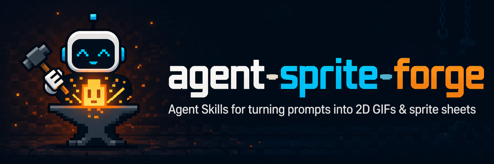
</p>

<p align="center">
  <strong>Codex skills for game-ready 2D sprites, layered maps, and engine-ready prototypes.</strong>
</p>

<p align="center">
  Ask in natural language. Codex plans the asset pipeline, renders with built-in image generation, then local processors clean, split, validate, and export assets for Godot, Unity, or raw 2D game workflows.
</p>

<p align="center">
  <a href="#showcase">Showcase</a> ·
  <a href="#included-skills">Skills</a> ·
  <a href="#install">Install</a> ·
  <a href="#suggested-prompts">Prompts</a> ·
  <a href="#star-history">Star History</a>
</p>

## What Makes It Different

Agent Sprite Forge is not just a folder of prompts. It is a Codex-first 2D game asset workflow where the agent decides the plan, image generation creates the raw visuals, and deterministic scripts turn those visuals into reusable game assets.

<table>
  <tr>
    <td width="25%">
      <strong>Sprite sheets</strong><br />
      Characters, monsters, props, attacks, spells, projectiles, impacts, idles, walks, and reference-guided variants.
    </td>
    <td width="25%">
      <strong>Layered maps</strong><br />
      Ground-only bases, dressed references, prop packs, transparent props, y-sort placement, collision, zones, and previews.
    </td>
    <td width="25%">
      <strong>Engine handoff</strong><br />
      Godot scenes, editable TileMap layers, separated props, encounter grass, collision bodies, exits, and debug players.
    </td>
    <td width="25%">
      <strong>Local cleanup</strong><br />
      Chroma-key removal, frame extraction, alignment, transparent PNG/GIF export, prop-pack slicing, and QA metadata.
    </td>
  </tr>
</table>

## Showcase

### Engine-Ready Prototypes

These examples were assembled with Codex using `agent-sprite-forge` workflows. They are meant to show the full loop: generated assets, structured scene data, and playable prototype wiring.

<table>
  <tr>
    <td align="center" width="50%">
      
      <br />
      <strong>Summon Survivors — Unity WebGL</strong>
      <br />
      Generated map art, hero sheets, summons, evolutions, enemies, bosses, pickups, HUD, FX, level-up choices, and WebGL deployment.
      <br />
      <a href="https://summon-survivors.vercel.app/">Play build</a> · <a href="https://drive.google.com/file/d/1TL7qRX95przTToZILVQ1EFwEXm3flB6t/view?usp=sharing">Build conversation</a>
    </td>
    <td align="center" width="50%">
      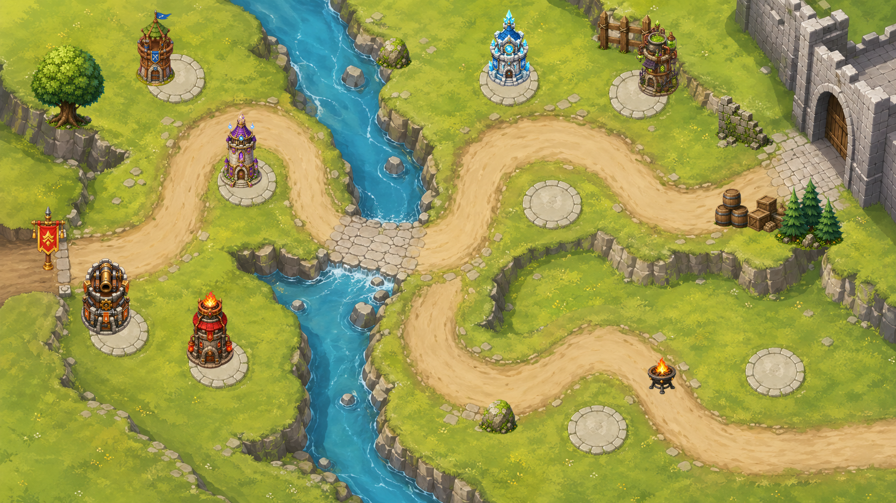
      <br />
      <strong>Forest Pass Defense — Godot Tower Defense</strong>
      <br />
      A Godot 4 prototype with map, separated props, tower slots, towers, enemy sheets, boss/flying enemies, waves, HUD, build/upgrade/sell flow, projectiles, and targeting rules.
    </td>
  </tr>
  <tr>
    <td align="center" width="50%">
      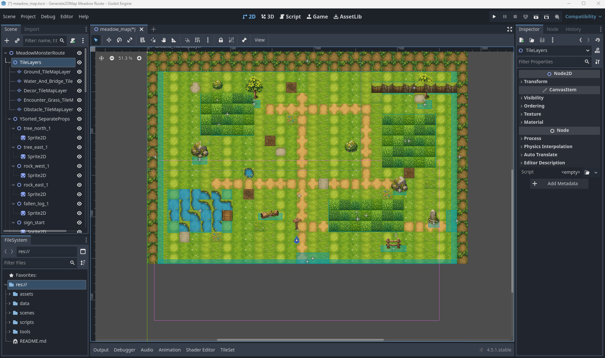
      <br />
      <strong>Editable RPG Map — Godot TileMap</strong>
      <br />
      Image-generated tileset and prop sheet wired into editable <code>TileMapLayer</code>, <code>Sprite2D</code> props, encounter grass <code>Area2D</code>, <code>StaticBody2D</code> collision, exits, metadata, and debug player/camera.
    </td>
    <td align="center" width="50%">
      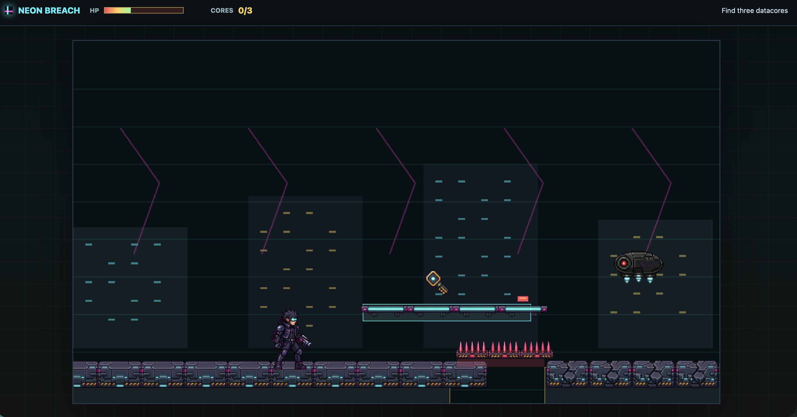
      <br />
      <strong>Neon Breach — Cyberpunk Side-Scroller</strong>
      <br />
      A playable side-scroller prototype built around generated character, attack, map, and gameplay assets.
    </td>
  </tr>
  <tr>
    <td align="center" width="50%">
      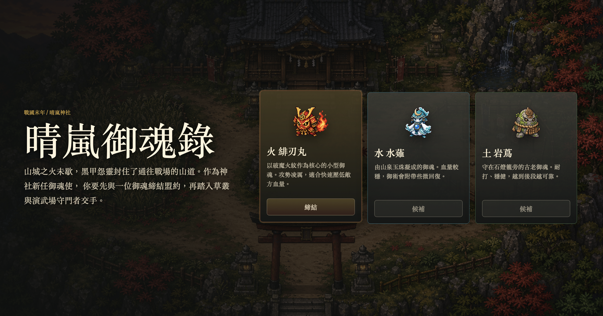
      <br />
      <strong>Sengoku Era — JavaScript Pokémon-like</strong>
      <br />
      A browser-based RPG prototype with generated characters, starter selection, map flow, and battle UI.
      <br />
      <a href="https://sengoku-era.vercel.app/">Play build</a>
    </td>
    <td align="center" width="50%">
      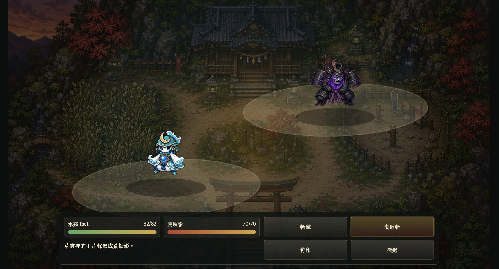
      <br />
      <strong>Starter selection and battle loop</strong>
      <br />
      A compact JavaScript game showcase built from sprite, monster, battle, and map assets generated through the skill workflow.
    </td>
  </tr>
</table>

<details>
<summary>More Godot tower-defense output</summary>

<table>
  <tr>
    <td align="center" width="40%">
      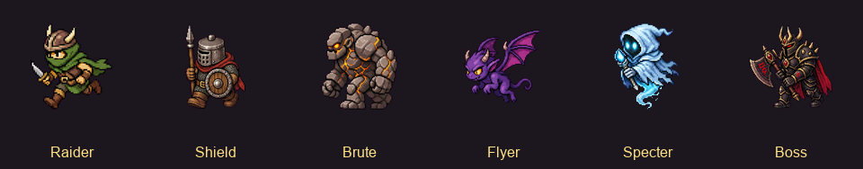
      <br />
      <strong>Enemy roster, including flyer and boss units</strong>
    </td>
    <td align="center" width="30%">
      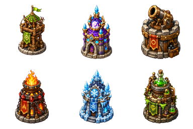
      <br />
      <strong>Tower lineup</strong>
    </td>
    <td align="center" width="30%">
      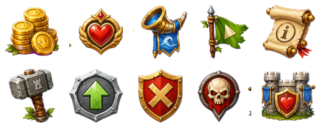
      <br />
      <strong>HUD and gameplay icons</strong>
    </td>
  </tr>
</table>

Godot prototype output includes:

- `scenes/ForestPass.tscn` with base map, separated props, enemy paths, tower slots, and HUD nodes.
- Six tower families with generated tower art and upgrade stages.
- Animated enemy sheets for ground units, flying units, and boss encounters.
- Wave, difficulty, tower catalog, collision, route, and tower-slot metadata.
- Runtime build, upgrade, sell, projectile, and targeting behavior connected in Godot.

```text
image_gen map + separated props + tower sheets + enemy animation sheets + HUD icons + Godot gameplay wiring
```

</details>

<details>
<summary>More Unity survivors-like output</summary>

<table>
  <tr>
    <td align="center" width="50%">
      
      <br />
      <strong>Unity WebGL gameplay: summons, enemies, pickups, HUD, and objective flow</strong>
    </td>
    <td align="center" width="50%">
      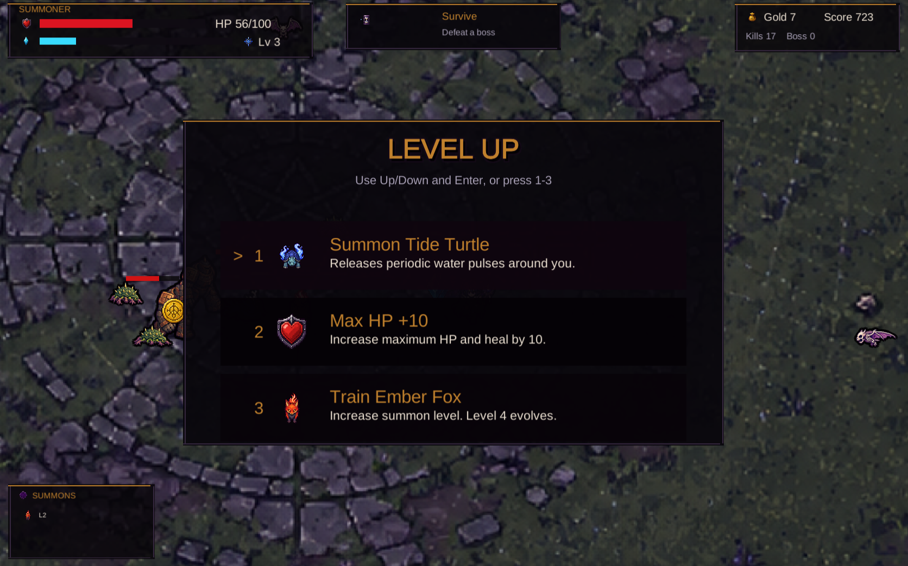
      <br />
      <strong>Level-up choices: summon unlocks, training, stats, and recovery</strong>
    </td>
  </tr>
</table>

Unity prototype output includes:

- `Assets/Survivors/Scenes/SummonSurvivors.unity` as the playable scene.
- `SurvivorContentDatabase.asset` connecting generated hero, summon, enemy, pickup, HUD, and FX sprites.
- Starter summon selection, survival objective, XP/coin pickups, level-up choices, summon training, and evolution flow.
- Enemy spawning pressure, boss timing, projectile attacks, area damage, health bars, and score tracking.
- WebGL build output under `Builds/WebGL` with Vercel deployment config.

```text
image_gen map + directional hero sheets + summon/evolution sheets + enemy sheets + FX/HUD icons + Unity runtime + WebGL deploy
```

</details>

### Sprite Sheets And FX

Use `$generate2dsprite` when you need animated units, playable characters, monsters, props, spell bundles, projectile/impact FX, or reference-guided variants.

<table>
  <tr>
    <td align="center" width="25%">
      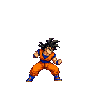
      <br />
      <strong>Text to sprite</strong>
      <br />
      Attack animation from a plain-language request.
    </td>
    <td align="center" width="25%">
      
      <br />
      <strong>Character action</strong>
      <br />
      Compact 2D action sheet with transparent export.
    </td>
    <td align="center" width="25%">
      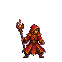
      <br />
      <strong>Spell cast</strong>
      <br />
      Bundle-friendly cast animation.
    </td>
    <td align="center" width="25%">
      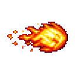
      <br />
      <strong>Projectile</strong>
      <br />
      Matching projectile / impact workflows.
    </td>
  </tr>
</table>

<table>
  <tr>
    <td align="center" width="25%">
      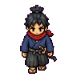
      <br />
      <strong>Down</strong>
    </td>
    <td align="center" width="25%">
      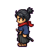
      <br />
      <strong>Left</strong>
    </td>
    <td align="center" width="25%">
      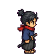
      <br />
      <strong>Right</strong>
    </td>
    <td align="center" width="25%">
      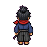
      <br />
      <strong>Up</strong>
    </td>
  </tr>
</table>

<table>
  <tr>
    <td align="center" width="35%">
      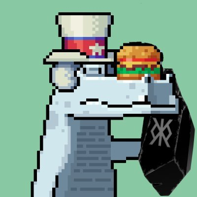
      <br />
      <strong>Reference</strong>
    </td>
    <td align="center" width="65%">
      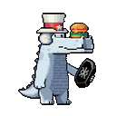
      <br />
      <strong>Reference-guided sprite animation</strong>
    </td>
  </tr>
  <tr>
    <td align="center" width="35%">
      
      <br />
      <strong>Reference</strong>
    </td>
    <td align="center" width="65%">
      
      <br />
      <strong>Reference-guided character action</strong>
    </td>
  </tr>
</table>

### Layered RPG Map Pipeline

Use `$generate2dmap` when you need maps instead of isolated sprites. For readable layered raster maps, the current workflow prefers a clean hand-painted HD game-map style: ground-only base first, dressed reference second, prop pack third, then transparent prop extraction and layered preview composition.

<table>
  <tr>
    <td align="center" width="33%">
      
      <br />
      <strong>Ground-only base</strong>
    </td>
    <td align="center" width="33%">
      
      <br />
      <strong>Dressed reference</strong>
    </td>
    <td align="center" width="33%">
      
      <br />
      <strong>3x3 prop pack</strong>
    </td>
  </tr>
</table>

<p align="center">
  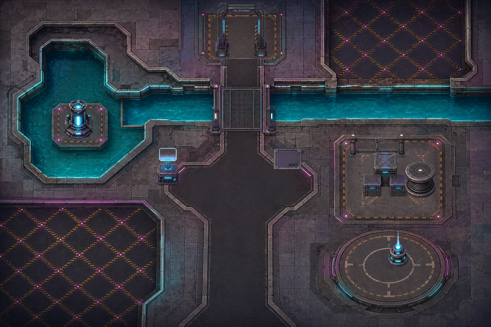
  <br />
  <strong>Flattened layered RPG map preview</strong>
</p>

```text
layered_raster + y_sorted_props + precise_shapes + trigger_zones + raw_canvas
```

### Godot Editable TileMap Export

`$generate2dmap` can also produce an editable Godot map project instead of a single flattened image. This showcase uses an image-generated tileset and 3x3 prop sheet, then wires them into a Godot 4.5 scene.

<p align="center">
  
  <br />
  <strong>Godot editor scene: editable layers, props, zones, collision, exits, and debug player</strong>
</p>

<table>
  <tr>
    <td align="center" width="50%">
      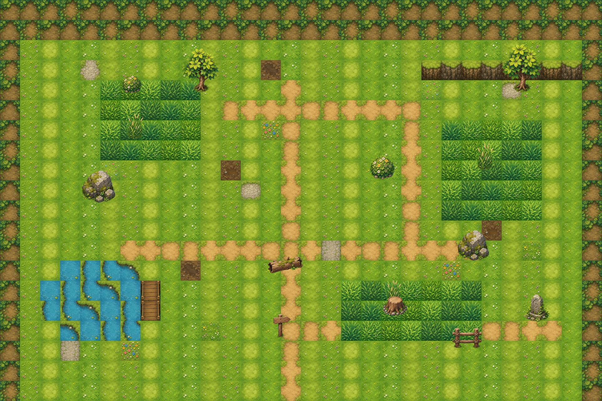
      <br />
      <strong>Layered map preview</strong>
    </td>
    <td align="center" width="50%">
      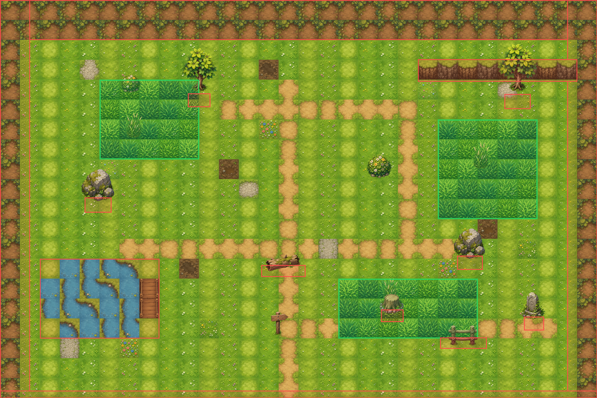
      <br />
      <strong>Collision and zone debug overlay</strong>
    </td>
  </tr>
  <tr>
    <td align="center" width="50%">
      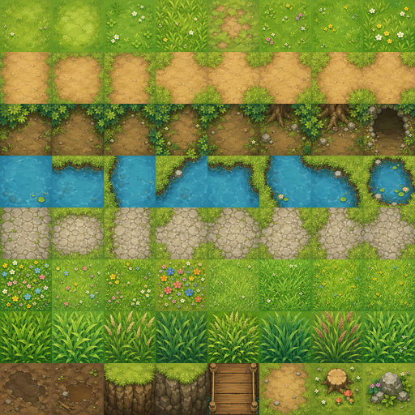
      <br />
      <strong>Image-generated tileset atlas</strong>
    </td>
    <td align="center" width="50%">
      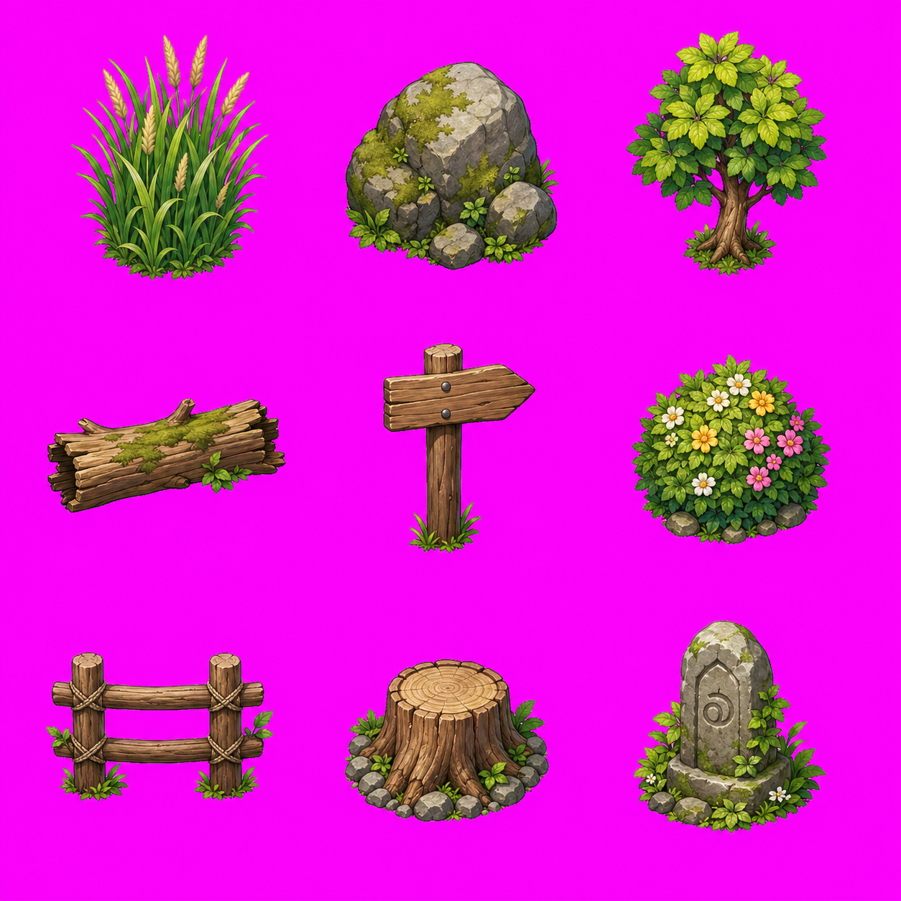
      <br />
      <strong>3x3 generated prop pack</strong>
    </td>
  </tr>
</table>

Godot output includes editable `TileMapLayer` nodes, independent `Sprite2D` props, encounter grass `Area2D` zones, `StaticBody2D` collision blockers, exit `Area2D` zones, and a debug player/camera.

```text
image_gen tileset + prop_pack_3x3 + layered_tilemap + separate_props + trigger_zones + Godot_TileMap
```

### Playable Game Prompt Examples

<details>
<summary>Cyberpunk side-scroller prompt</summary>

```text
use $generate2dsprite to create a 2D side-scrolling game similar to Mega Man. It should include attack mechanics, map elements, and all the essential features. I would like you to design it, and all the necessary assets should be created using this skill. It needs to be an actually playable game, with a cyberpunk story setting.
```

</details>

<details>
<summary>Sengoku Pokémon-like prototype</summary>

Link: <a href="https://sengoku-era.vercel.app/">Play the JavaScript browser build</a>

<table>
  <tr>
    <td align="center" width="50%">
      
      <br />
      <strong>Starter selection</strong>
    </td>
    <td align="center" width="50%">
      
      <br />
      <strong>Battle scene</strong>
    </td>
  </tr>
</table>

```text
Use $generate2dsprite to create a 2D game similar to Pokemon. You only need to build one scene for now. It must include a starter monster selection mechanic, a battle screen, and all basic gameplay functions. I would like you to design all the elements and the story, and you can also decide which game engine to use. Use this skill to create any assets you need. The story should be set in the Sengoku period.
```

</details>

## Included Skills

| Skill | Use it for | Output | Runtime |
| --- | --- | --- | --- |
| [`generate2dsprite`](./skills/generate2dsprite) | Sprites, animation sheets, props, spell bundles, FX, reference variants, optional layout guides for fixed-frame sheets | Raw sheet, cleaned transparent sheet, frames, GIFs, metadata | Codex / Grok (image gen) |
| [`generate2dmap`](./skills/generate2dmap) | Baked maps, layered raster maps, clean HD RPG maps, prop packs, collision/zones, Godot-editable scenes | Base map, dressed reference, prop pack, extracted props, preview, scene metadata | Codex / Grok (image gen) |
| [`video2dsprite`](./skills/video2dsprite) | **Denser motion sprites from video**: base still → `image_to_video` → frame extract → magenta chroma → multi-density sprite strips/GIFs | Video, raw/clean frames, 8/16/24/48 sprite sets, strips, preview GIFs | **Grok Build only** |

### Grok Build only: `$video2dsprite`

`$video2dsprite` is a **Grok Build exclusive** skill. It depends on Grok's native **`image_gen` / `image_edit` + `image_to_video`** tools (still → short clip). Codex and other agents do not have `image_to_video`, so they cannot run the generation half of this pipeline.

Use it when you want **smoother intermediate poses** (e.g. run/walk cycles) by sampling dense frames from a 6s in-place motion clip. Tradeoffs: softer pixels, possible identity drift, chroma fringe — for crisp production sheets, keep using `$generate2dsprite`.

Install for Grok Build by copying skills into `~/.grok/skills` (see [Install](#install)). On Codex, install is still `~/.codex/skills`; `$video2dsprite` will load but must refuse the video step if tools are missing.

#### Case study: Ryo run (16 denser frames)

Pipeline: **base still → image_to_video (6s) → chroma key → 16-frame strip**.

> **Note:** GitHub README does **not** reliably render `<video>` tags (especially inside tables). Motion is shown as **GIF** previews; MP4 files are still in the repo for download / local play.

| Base still | Motion (`image_to_video`) | Sprite result (16f) |
| --- | --- | --- |
| 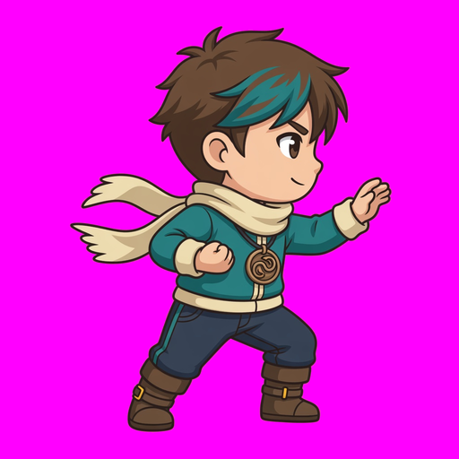 | 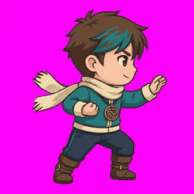<br />[Download MP4](./src/video2dsprite-ryo/run-6s.mp4) | 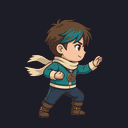 |

<p align="center">
  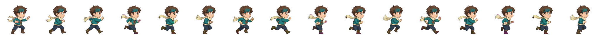<br />
  <em>16-frame strip (feet-aligned, denser than a classic 6–8 pose sheet)</em>
</p>

Short skill intro (MP4, open file): [intro.mp4](./src/video2dsprite-ryo/intro.mp4)

<details>
<summary>Case assets on disk (~2–3 MB — safe for git)</summary>

```text
src/video2dsprite-ryo/
  base.png              # identity still (docs size)
  run-6s.mp4            # image_to_video clip (compressed)
  run-6s-preview.gif    # same motion as GIF for README display
  strip-16.png          # denser sprite strip
  preview-16.gif        # sprite loop for README
  intro.mp4             # short skill explainer
```

We intentionally **do not** commit raw 145-frame dumps or full-resolution working folders.

</details>

`$generate2dmap` only uses `$generate2dsprite` when the selected map pipeline needs reusable transparent props. Small environmental props can be batched into `2x2`, `3x3`, or `4x4` prop packs, then extracted into individual transparent props. Simple maps can stay as a single baked image.

When a visual reference is involved, the image skills follow the same wrapper rule: make the image visible in the conversation first. Attached images and freshly generated images are already visible; local files should be opened with `view_image` before asking built-in image generation to preserve identity, style, map layout, or sprite lineage.

## How It Works

1. The user asks Codex for a sprite, prop pack, map, or engine-ready prototype.
2. The agent chooses the asset type, action, bundle shape, sheet layout, frame count, style, and alignment strategy.
3. Built-in image generation creates the raw visual asset.
4. Local scripts run deterministic post-processing: chroma-key cleanup, despill, frame extraction, alignment, prop-pack slicing, GIF/PNG export, and validation metadata.
5. For maps and prototypes, Codex can also assemble placement metadata, collision, trigger zones, Godot scenes, or Unity project wiring.

The script is not the creative brain. The agent makes the visual and pipeline decisions; the Python tools only perform repeatable pixel and export operations.

## What It Can Generate

- Creatures, characters, players, NPCs, props, and monsters
- Spell casts, projectiles, impacts, explosions, and FX sheets
- Small bundles such as `unit_bundle`, `spell_bundle`, and `combat_bundle`
- Reference-guided sprite variants, animation sheets, and evolution lines
- Single baked maps, clean HD layered maps, prop-pack maps, and flattened previews
- Collision and zone metadata for playable maps
- Godot-ready editable maps with `TileMapLayer`, separate props, encounter grass, collision, exits, and debug player scenes
- Prototype-scale Godot and Unity scenes when the user asks Codex to wire assets into an engine project

## Install

Local processors need **Python**, **Pillow**, **numpy**, and (for `$video2dsprite`) **ffmpeg** on `PATH`.

### Option 1: Windows PowerShell

Clone the repo, install dependencies, then copy skills into the agent skills directory you use:

```powershell
git clone https://github.com/0x0funky/agent-sprite-forge.git
cd .\agent-sprite-forge
python -m pip install -r .\requirements.txt

# Codex
New-Item -ItemType Directory -Force -Path "$env:USERPROFILE\.codex\skills" | Out-Null
Copy-Item -Recurse -Force ".\skills\*" "$env:USERPROFILE\.codex\skills\"

# Grok Build (required for $video2dsprite video generation)
New-Item -ItemType Directory -Force -Path "$env:USERPROFILE\.grok\skills" | Out-Null
Copy-Item -Recurse -Force ".\skills\*" "$env:USERPROFILE\.grok\skills\"
```

### Option 2: macOS / Linux

```bash
git clone https://github.com/0x0funky/agent-sprite-forge.git
cd ./agent-sprite-forge
python3 -m pip install -r ./requirements.txt

# Codex
mkdir -p ~/.codex/skills
cp -R ./skills/* ~/.codex/skills/

# Grok Build (required for $video2dsprite video generation)
mkdir -p ~/.grok/skills
cp -R ./skills/* ~/.grok/skills/
```

Start a new Codex or Grok Build session after installation so skills reload.

**Note:** `$generate2dsprite` and `$generate2dmap` work wherever built-in image generation is available. **`$video2dsprite` full pipeline only works in Grok Build** (`image_to_video`). The Python postprocessor can still re-sample already-exported frames on any machine with ffmpeg + Pillow.

## Python Requirements

The local post-processors depend on:

- `Pillow`
- `numpy`
- `ffmpeg` (CLI on `PATH`) for `$video2dsprite` frame extraction

They are listed in [`requirements.txt`](./requirements.txt) (Python only). Image/video generation is provided by the host agent; these packages handle magenta cleanup, frame splitting, alignment, GIF/PNG export, prop-pack slicing, and video-frame sampling.

## Repository Layout

```text
agent-sprite-forge/
  README.md
  README.zh-TW.md
  README.zh-CN.md
  README.ja.md
  README.ko.md
  requirements.txt
  src/
  skills/
    generate2dmap/
      SKILL.md
      agents/
        openai.yaml
      references/
        layered-map-contract.md
        map-strategies.md
        prop-pack-contract.md
      scripts/
        compose_layered_preview.py
        extract_prop_pack.py
    generate2dsprite/
      SKILL.md
      agents/
        openai.yaml
      references/
        modes.md
        prompt-rules.md
      scripts/
        generate2dsprite.py
        make_layout_guide.py
    video2dsprite/                 # Grok Build only (image_to_video)
      SKILL.md
      agents/
        openai.yaml
      references/
        pipeline.md
        prompt-rules.md
      scripts/
        video2dsprite.py
  src/
    video2dsprite-ryo/             # README case study (~2–3 MB)
      base.png
      run-6s.mp4
      run-6s-preview.gif           # motion GIF (GitHub-safe)
      strip-16.png
      preview-16.gif
      intro.mp4
```

## Suggested Prompts

### Sprite

```text
Use $generate2dsprite to create a 3x3 idle for an ultimate earth titan.
```

```text
Use $generate2dsprite to create a side-view lightning knight attack animation.
```

```text
Use $generate2dsprite to create a late-Sengoku player_sheet for a wandering fire swordsman.
```

```text
Use $generate2dsprite to create a wizard spell bundle with cast, projectile, and impact sprites.
```

### Video → dense sprites (Grok Build only)

```text
Use $video2dsprite with my existing side-view hero PNG as base. Generate a 6s in-place run on #FF00FF, extract frames, chroma key, and export 8/16/24/48 sprite sets + preview GIFs. Do not wire into the game; just report paths.
```

```text
Use $video2dsprite to create a smooth side-scroller walk cycle from a new magenta-background still, 6 seconds, then sample 24 feet-aligned frames.
```

### Map

```text
Use $generate2dmap to create a small fixed-screen pixel-art battle arena with simple collision.
```

```text
Use $generate2dmap to create a top-down RPG forest shrine map. Use a layered raster pipeline, a 3x3 prop pack for small environmental props, precise collision, encounter grass zones, a rest point, and actors that can walk in front of and behind tall props.
```

```text
Use $generate2dmap to create a Godot-editable RPG map with separated props, encounter grass Area2D zones, collision StaticBody2D blockers, exit zones, and a debug player scene.
```

## What You Get

For a typical sprite sheet output:

- `raw-sheet.png`
- `raw-sheet-clean.png`
- `sheet-transparent.png`
- Frame PNGs
- `animation.gif`
- `prompt-used.txt`
- `pipeline-meta.json`

For player walk sheets, you also get direction strips and per-direction GIFs.

For a map output, the result depends on the chosen pipeline:

- Single baked map: complete map image, optional prompt file, and optional collision metadata.
- Layered raster map: base map, dressed reference, prop folders or prop-pack extraction manifest, prop placement metadata, collision/zones metadata, and flattened layered preview.
- Godot editable map: tileset/prop assets, scene files, layer metadata, collision/zones, exits, and debug player setup.

## Notes

- Best results come from prompts that clearly specify view, action, and desired motion style.
- Large creatures often work better as `3x3 idle`.
- Small spells and projectiles often work better as `1x4`, `2x2`, or `2x3`.
- Layout guides are useful for fixed-frame action sheets and prop packs, but they are not always better for compact attack sheets.
- For commercial projects, prefer original characters or IP that you control.

## Star History

<a href="https://www.star-history.com/?repos=0x0funky%2Fagent-sprite-forge&type=date&legend=top-left">
 <picture>
   <source media="(prefers-color-scheme: dark)" srcset="https://api.star-history.com/chart?repos=0x0funky/agent-sprite-forge&type=date&theme=dark&legend=top-left" />
   <source media="(prefers-color-scheme: light)" srcset="https://api.star-history.com/chart?repos=0x0funky/agent-sprite-forge&type=date&legend=top-left" />
   
 </picture>
</a>

## License

MIT. See [LICENSE](./LICENSE).
